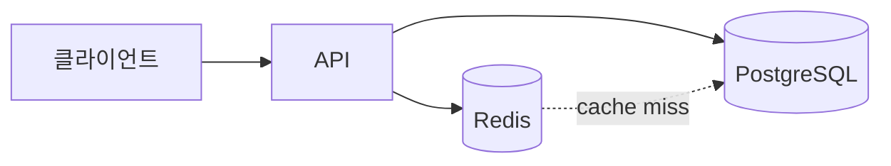
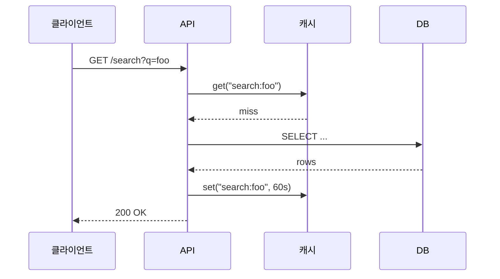

# /html-report-ko — 마크다운 → 한국어 HTML 보고서 (Mermaid 포함)

한국어 보고서를 한 파일짜리 HTML로 생성하는 스킬. **본문은 한국어로 작성**하고,
Mermaid 다이어그램의 노드 라벨도 한국어로 자유롭게 쓸 수 있습니다. 헤드 태그,
스타일, 스크립트 같은 보일러플레이트는 LLM이 출력하지 않습니다 — 빌드 스크립트가
처리합니다.

## 언제 사용하는가

- 사용자가 한국어 HTML 보고서, 분석 문서, 대시보드 요약을 요청할 때
- 결과물에 Mermaid 다이어그램(플로우차트, 시퀀스, ER, 간트 등)이 필요할 때
- 브라우저로 바로 열거나 메일로 첨부할 단일 파일이 필요할 때
- `<head>`/`<style>` 보일러플레이트를 매번 다시 쓰고 싶지 않을 때

## 토큰 절약 원리

스킬 디렉터리에는 다음이 미리 들어있습니다:
- `assets/report.css` — 한글 폰트 우선 스타일시트 (~9KB, 약 280줄)
- `assets/template.html` — placeholder 기반 HTML 골격

LLM은 이 파일들의 내용을 출력하지 않습니다. 마크다운 본문만 작성하면
빌드 스크립트가 합성합니다. 일반적인 3페이지 보고서 기준 **회당 3-5K 토큰**
절약 + `mermaid.initialize` 같은 세부 코드를 외우지 않아도 됩니다.

## 작업 흐름

1. 보고서 본문을 마크다운으로 임시 파일에 작성 (한국어).
2. 빌드 스크립트 실행 → 최종 HTML 생성.
3. (선택) 사용자에게 경로 알려주거나 브라우저로 열기 안내.

## 1단계 — 마크다운 본문 작성

`.md` 파일에 저장. 임시 디렉터리도 무방. 지원되는 마크다운 요소:
헤딩, 단락, 리스트, 표, 인용구, 코드 블록, 인라인 코드, 링크, 이미지,
수평선, **굵게**/*기울임*, 그리고 ```` ```mermaid ```` fence.

예시:

````markdown
# 3분기 성능 리뷰

> 성능팀 작성. 별도 표기 없으면 모든 수치는 wall-time p50 기준.

## 시스템 구조



## 핵심 지표

| 지표           | 2분기   | 3분기   | 변화율  |
|----------------|---------|---------|---------|
| p50 응답시간   | 38ms    | 42ms    | +10%    |
| p99 응답시간   | 290ms   | 380ms   | +31%    |
| 캐시 히트율    | 84%     | 67%     | -17%p   |

## 발견 사항

1. 11주차 배포 이후 캐시 히트율 급락
2. p99 회귀는 `/search` 엔드포인트에 집중
3. 자세한 대응 방안은 [런북](https://example.com/runbook) 참고

## 일반 요청 흐름


````

작성 가이드:
- 첫 번째 `# H1`이 페이지 제목이 됨 (필요시 `--title`로 덮어쓰기 가능)
- Mermaid 노드 라벨에 한국어를 넣으려면 `[한국어 텍스트]` 또는 `["한국어 텍스트"]` 형식 사용
- 표는 표준 파이프 문법. 정렬은 `:---:` 사용 가능
- `<details>`, `<summary>` 같은 HTML 태그도 그대로 동작

## 2단계 — HTML 빌드

```bash
python3 ~/.claude/skills/html-report-ko/scripts/build.py \
  --input <마크다운-경로>
```

`--output`을 생략하면 **입력 파일과 동일한 디렉터리·동일한 이름의 `.html`**로
저장됩니다 (예: `report.md` → `report.html`). 사용자가 별도 경로를 지정하지 않으면
이 기본 경로를 그대로 사용하고, 임의의 새 경로를 만들지 마세요.

### 플래그

| 플래그 | 기본값 | 설명 |
|--------|--------|------|
| `--input PATH`     | (필수) | 마크다운 입력 파일 |
| `--output PATH`    | `<input>.html` (입력 옆) | HTML 출력 경로 — 사용자가 명시하지 않으면 생략 |
| `--title TEXT`     | 첫 H1 | 페이지 `<title>`과 헤더 |
| `--inline-css`     | off | CSS를 `<style>` 태그로 인라인 (단일 파일) |
| `--theme {light\|dark\|auto}` | `auto` | 색상 모드. `auto`는 `prefers-color-scheme` 따라감 |
| `--mermaid-version VER` | `10` | CDN에서 불러올 Mermaid 메이저 버전 |
| `--no-mermaid`     | off | Mermaid 스크립트 태그 생략 (다이어그램 없을 때) |
| `--korean-webfont` | off | Pretendard 웹폰트를 CDN에서 추가 로드 (네트워크 필요) |

### 기본 동작 (CSS 외부 링크)

`--inline-css` 없이 실행하면 `assets/report.css`를 출력 디렉터리에 복사하고
`<link rel="stylesheet" href="report.css">`로 연결합니다. 결과물은 두 파일
(`*.html` + `report.css`). 추후 CSS 수정이 쉽지만 첨부 공유엔 불편.

### `--inline-css` (단일 파일)

CSS를 `<style>` 태그에 임베드하여 한 개의 `.html` 파일만 생성. 메일 첨부,
정적 호스팅, 사내 위키 업로드에 편함. Mermaid는 여전히 CDN에서 로드되므로
오프라인에서는 다이어그램이 코드 블록으로 보임.

### `--korean-webfont`

Pretendard 웹폰트를 jsDelivr에서 추가로 로드. 시스템에 설치된 한글 폰트(맑은
고딕, Apple SD Gothic Neo)와 무관하게 통일된 모양. 단점은 네트워크 필요 +
파일이 약간 무거움.

## 3단계 — 결과 안내

생성된 HTML 경로를 사용자에게 알려주세요. macOS에서 바로 열려면:

```bash
open <output-path>
```

자동 실행하지 말 것 — 사용자가 먼저 검토할 수 있게.

## 빌드 스크립트가 하는 일

1. 마크다운 입력을 읽음
2. `--title` 미지정 시 첫 `# H1`에서 추출 (없으면 "보고서")
3. ```` ```mermaid ```` fence를 sentinel로 치환 (마크다운 라이브러리가 escape 못 하게)
4. python-markdown으로 HTML 변환 (없으면 `--user`로 자동 설치, 그것도 실패하면 내장 폴백 컨버터)
5. sentinel을 `<pre class="mermaid">...</pre>`로 복원
6. `assets/template.html` 로드 후 placeholder 치환 (`{{TITLE}}`, `{{BODY}}`, `{{THEME}}`, `{{GENERATED_AT}}`, `{{CSS_TAG}}`, `{{MERMAID_TAG}}`, `{{KOREAN_WEBFONT_TAG}}`)
7. CSS는 외부 링크 또는 인라인 (플래그에 따라)
8. 최종 HTML 작성

## Mermaid 한국어 다이어그램 팁

| 다이어그램 | 시작 줄 | 한국어 사용 |
|------------|---------|-------------|
| 플로우차트 | `graph TD` / `graph LR` | `노드ID[한국어 라벨]` |
| 시퀀스     | `sequenceDiagram` | `participant 이름 as 한국어` |
| 클래스     | `classDiagram` | 클래스명은 영문 권장, 메서드 설명은 한국어 가능 |
| 상태       | `stateDiagram-v2` | 상태명: `상태1: 한국어 설명` |
| ER         | `erDiagram` | 엔티티명 영문, 라벨 한국어 |
| 간트       | `gantt` | `title 프로젝트 일정` |
| 파이       | `pie` | `"한국어 라벨" : 42` |
| 사용자 여정 | `journey` | 자유롭게 한국어 |

특수문자가 들어간 라벨은 따옴표로 감싸기: `A["주문 (단건)"]`

### 자주 깨지는 패턴 (반드시 피할 것)

1. **mindmap에 `<br/>` 금지.** mindmap은 HTML 태그를 지원하지 않습니다. 줄바꿈이
   필요하면 들여쓰기로 자식 노드를 만드세요. (빌드 스크립트가 mindmap의 `<br/>`을
   자동으로 공백으로 치환하지만, 의도한 줄바꿈은 노드 분리로 표현하는 게 깔끔합니다.)
2. **노드 라벨 안의 특수문자(`/`, `(`, `)`, `:`, `,`, `&`)는 따옴표로 감싸기.**
   `[a/b/c]` ❌  →  `["a/b/c"]` ✅
3. **시퀀스 다이어그램에서 `Note over A,B: 텍스트`의 `:` 뒤 공백 필수.**
4. **엣지 라벨(`-->|텍스트|`)에 `/`, `:`이 있으면 백틱 또는 HTML 엔티티 사용.**
   복잡하면 노드 라벨로 옮기는 게 안전합니다.

Mermaid 공식 레퍼런스: https://mermaid.js.org/

## 실패 모드

- `markdown` 라이브러리 없고 pip 설치 차단됨 → 내장 폴백 컨버터로 헤딩/단락/리스트/표/코드/인용/굵게/기울임/링크 처리. 각주, TOC 같은 고급 기능은 빠짐.
- `--input` 경로 없음 → 에러, exit 1
- `--output` 부모 디렉터리 없음 → 자동 생성
- Mermaid 블록 문법 오류 → 브라우저에서 빨간 에러로 표시되지만 나머지 본문은 정상

## 커스터마이즈

- 모든 보고서의 스타일을 한 번에 바꾸려면 `~/.claude/skills/html-report-ko/assets/report.css` 편집. 이후 빌드부터 적용됨 (이미 만들어진 보고서는 자기 시점의 CSS 유지).
- 헤더/푸터에 회사 로고 추가 같은 변경은 `assets/template.html` 수정. `{{...}}` placeholder는 그대로 둘 것.
- 영문 보고서는 별도 스킬 [`html-report`](../html-report/SKILL.md) 사용 — 폰트 스택과 기본 문구가 영문 우선.

## 영문 스킬과의 차이점

| 항목 | `html-report` | `html-report-ko` |
|------|---------------|------------------|
| SKILL.md 언어 | 영문 | 한국어 |
| `<html lang>` | `en` | `ko` |
| 폰트 스택 1순위 | system-ui (영문) | Pretendard / 맑은 고딕 / Apple SD Gothic Neo |
| 줄간격 | 1.65 | 1.75 (한국어 가독성) |
| 헤더 라벨 | "Generated" | "생성일시" |
| 기본 제목 | "Report" | "보고서" |
| 한글 웹폰트 옵션 | 없음 | `--korean-webfont` (Pretendard CDN) |
