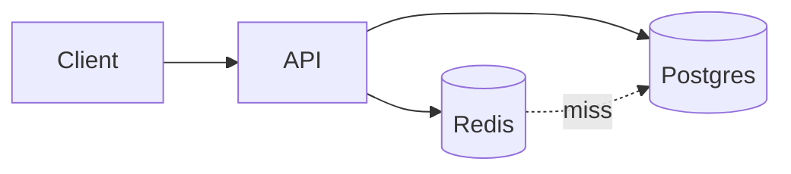
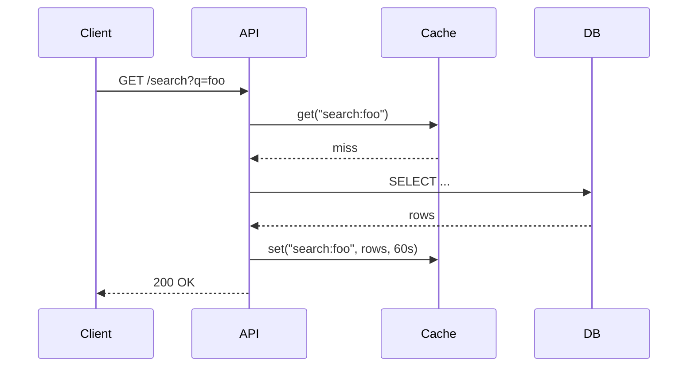

# /html-report — Markdown → styled HTML report with Mermaid

Generate polished, shareable HTML reports. You write **only the markdown
body**. The bundled build script wraps it in a pre-styled HTML template,
loads Mermaid from CDN, and links the bundled CSS.

## When to use

- User asks for an HTML report, dashboard summary, or visual analysis doc.
- The output should include diagrams (flowcharts, sequence, ER, gantt, …).
- You want a single file you can open in a browser or share.
- You don't want to re-type the same `<head>` / `<style>` boilerplate.

## Token-saving rationale

The skill ships `assets/report.css` (~7KB of typography, tables, code
blocks, mermaid styling, dark-mode, print) and `assets/template.html`.
You never emit any of that. You only emit the markdown body of the
report. The build script handles the rest.

Typical savings vs. emitting a full standalone HTML report: **3–5K tokens
per run**, plus you don't have to remember the exact `mermaid.initialize`
incantation.

## Pipeline

1. Write the report content as markdown to a file.
2. Run the build script to produce final HTML.
3. (Optional) Open it in a browser or attach to a reply.

## Step 1 — Write the markdown content

Save to a `.md` file (anywhere — temp is fine). Markdown features
supported: headings, paragraphs, lists, tables, blockquotes, code blocks,
inline code, links, images, horizontal rules, **bold**/*italic*.

For diagrams, use a fenced ```` ```mermaid ```` block. Example content:

````markdown
# Q3 Performance Review

> Generated by the Performance team. Numbers are wall-time p50 unless noted.

## Architecture



## Key metrics

| Metric          | Q2     | Q3     | Δ      |
|-----------------|--------|--------|--------|
| p50 latency     | 38ms   | 42ms   | +10%   |
| p99 latency     | 290ms  | 380ms  | +31%   |
| Cache hit rate  | 84%    | 67%    | -17pp  |

## Findings

1. Cache hit rate dropped after the W11 deployment.
2. p99 regression is concentrated on the `/search` endpoint.

## Sequence of a typical request


````

Tips:
- The first `# H1` becomes the page title (you can override with `--title`).
- Use ` ```mermaid ` not ` ```{mermaid} `. The build script looks for the
  former.
- Tables use standard pipe syntax. Alignment via `:---:` works.
- Inline `<details>` / `<summary>` HTML works if you need collapsibles.

## Step 2 — Build the HTML

```bash
python3 ~/.claude/skills/html-report/scripts/build.py \
  --input <path-to-md>
```

If you omit `--output`, the HTML is written **next to the input** with the same
stem (e.g. `report.md` → `report.html`). Use this default unless the user has
explicitly requested a different location — don't invent paths.

### Flags

| Flag | Default | Meaning |
|------|---------|---------|
| `--input PATH`     | (required) | Markdown source. |
| `--output PATH`    | `<input-stem>.html` next to input | HTML output path. Omit unless the user specified one. |
| `--title TEXT`     | first H1 | Page `<title>` and report header. |
| `--inline-css`     | off | Inline `report.css` in a `<style>` tag instead of linking to a copied file. Use for single-file portable output. |
| `--theme {light\|dark\|auto}` | `auto` | Color scheme. `auto` follows the reader's `prefers-color-scheme`. |
| `--mermaid-version VER` | `10` | Mermaid major version to load from CDN. |
| `--no-mermaid`     | off | Skip the Mermaid script tag entirely (use if there are no diagrams; saves a network request). |

### Default behavior (linked CSS)

Without `--inline-css`, the script copies `assets/report.css` to
`<output-dir>/report.css` (next to the HTML) and uses
`<link rel="stylesheet" href="report.css">`. The output is two files:
the `.html` and the `.css` next to it. Easier to tweak the CSS later;
worse for sharing as a single attachment.

### `--inline-css` (portable single file)

Embeds the CSS in a `<style>` tag. The output is one self-contained
`.html` file you can email, attach, or drop on any static host. Mermaid
still loads from CDN, so opening offline shows code blocks instead of
diagrams.

### Want true offline?

Pass `--inline-css --no-mermaid` and convert any diagrams to SVG/PNG
yourself first. Or pre-render Mermaid via the `mmdc` CLI and embed.
Out of scope for this skill's defaults.

## Step 3 — Done

Tell the user where the HTML lives. If they're on macOS and you want to
open it for them, suggest:

```bash
open <output-path>
```

Don't run `open` automatically — the user may want to inspect the file
first.

## What the build script does

1. Reads markdown input.
2. Extracts title from first `# H1` if `--title` not given (fallback: "Report").
3. Pre-processes `mermaid` fenced code blocks → `<pre class="mermaid">...</pre>`
   so the markdown lib doesn't escape them.
4. Converts the rest with Python's `markdown` library
   (auto-installs to user site-packages if missing — single dependency).
5. Loads `assets/template.html`, substitutes `{{TITLE}}`, `{{BODY}}`,
   `{{THEME}}`, `{{GENERATED_AT}}`, `{{CSS_TAG}}`, `{{MERMAID_TAG}}`.
6. Either copies `assets/report.css` next to the output (default) or
   inlines it (`--inline-css`).
7. Writes the final HTML.

## Mermaid quick reference

Useful inside ```` ```mermaid ```` fences:

| Diagram | Opening line |
|---------|--------------|
| Flowchart | `graph TD` (top-down) or `graph LR` (left-right) |
| Sequence | `sequenceDiagram` |
| Class | `classDiagram` |
| State | `stateDiagram-v2` |
| ER | `erDiagram` |
| Gantt | `gantt` |
| Pie | `pie` |
| User journey | `journey` |
| Timeline | `timeline` |
| Quadrant | `quadrantChart` |

### Mermaid pitfalls (avoid these)

1. **No `<br/>` inside `mindmap` nodes.** Mindmap doesn't accept HTML tags — use
   nested indentation for hierarchy instead. (The build script auto-strips
   `<br/>` from mindmap blocks as a safety net, but write structure with child
   nodes from the start.)
2. **Quote labels containing `/`, `(`, `)`, `:`, `,`, or `&`.**
   `[a/b/c]` ❌  →  `["a/b/c"]` ✅
3. **Edge labels (`-->|text|`) with special chars** are fragile — prefer moving
   the text into a node, or wrap with backticks.
4. **`Note over A,B: text`** in sequence diagrams requires the space after `:`.

Mermaid syntax reference: https://mermaid.js.org/

## Failure modes

- `markdown` not installed and pip blocked → script falls back to a
  minimal in-house markdown converter that handles headings, paragraphs,
  lists, tables, code blocks, inline `code`/`**bold**`/`*italic*`, links.
  Less polished but works.
- `--input` path missing → error, exit 1.
- `--output` parent dir doesn't exist → script creates it.
- A `mermaid` block has a syntax error → renders as a Mermaid error in
  the browser (red text) but the rest of the report is fine.

## Customizing

Want different styling globally? Edit `~/.claude/skills/html-report/assets/report.css`.
Every report built afterwards uses the new styles (since linked CSS is
copied at build time). Reports already built keep their old CSS until
rebuilt.

Want a different template (e.g. add a logo, footer)? Edit
`assets/template.html`. Keep the `{{…}}` placeholders intact.
